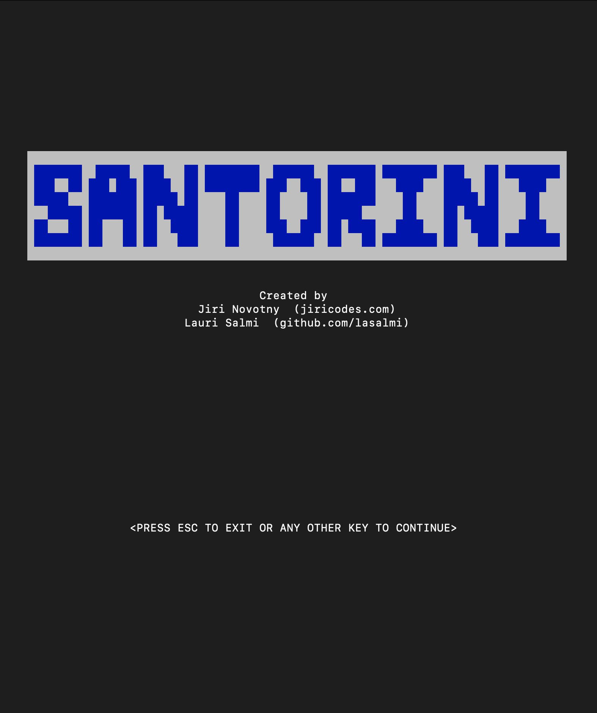
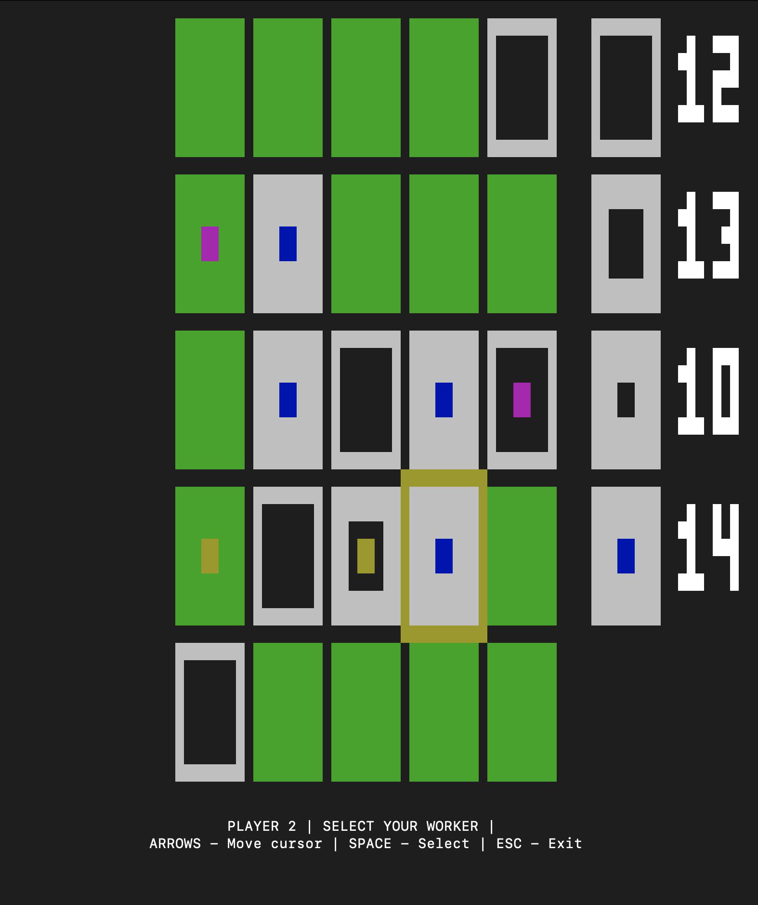

# Hive Rushes - Abstract Game: Santorini

This is a Hive Helsinki Coding School's rush project of abstract games. Project is based on the board game called Santorini and its implementation in C language.

## Santorini, the game

> Santorini is an accessible strategy game, simple enough for an elementary school classroom while aiming to provide gameplay depth and content for hardcore gamers to explore. [boardgamegeek.com]

Our implementation covers only the very basic rules for 2 players. Here is the complete [Rule Book](/resources/5d-santorini-rulebook.pdf).

<p float="center">
  
  
</p>

## Usage

We have included a Makefile to take care of almost everything.

### Prerequirements
The game needs to be compiled and therefore a compiler is required. Linux generally comes with one built-in, MacOS usually needs Xcode installed.

We used `ncurses` library which should be present by default. If not following packages should take care of everything:
```
sudo apt-get install build-essential libncurses-dev
```

### Basic
To build, test and run the game use `make` command.

To run the game use `make run`. Or eventually `./santorini` after building it.

To solely build the game run `make santorini`.

To run tests `make test`

To cleanup `make clean` or `make fclean` to additionally remove compiled binaries.


## Controls
In each stage, you can move the cursor to a desired tile and select it with `SELECT`. Specifically in setup stage, a free worker will be placed on selected tile. In move stage, first select the worker you desire to use in this turn. Then select a tile to move the worker to. After the move, there's the build stage that requires you to select a valid tile for building.

### Key map

```
Arrow keys: MOVE CURSOR

Spacebar: SELECT

Escape: EXIT
```

## Contributors

[Jiri Novotny](https://www.jiricodes.com/)

[Lauri Salmi](https://github.com/lasalmi)

## License
[MIT](LICENSE)
